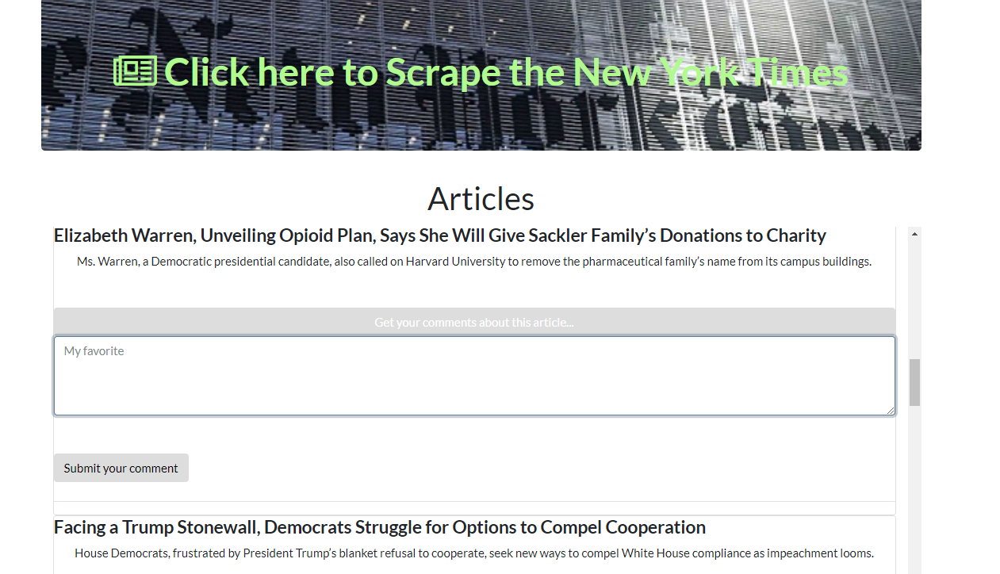

# ScrapeNews
Web app that allow users to load, view and leave comments on the latest news.

## How it works

- When loading first time, the application does not show information. 
- Click the banner at the top of the page and the application will do the scraping at NY Times/sections/us
- The application will search the mongoDB database and will do the following:
   - Search for each article
   - Insert the article if not found
   - Retrieve the article in the DB if found

- The articles are listed. User will see two options:
   - Submit comment - write in the text box and click submit
   - Add other comment 

## See the Heroku page

Check the deployed project at:
https://sleepy-beyond-15604.herokuapp.com/ 
